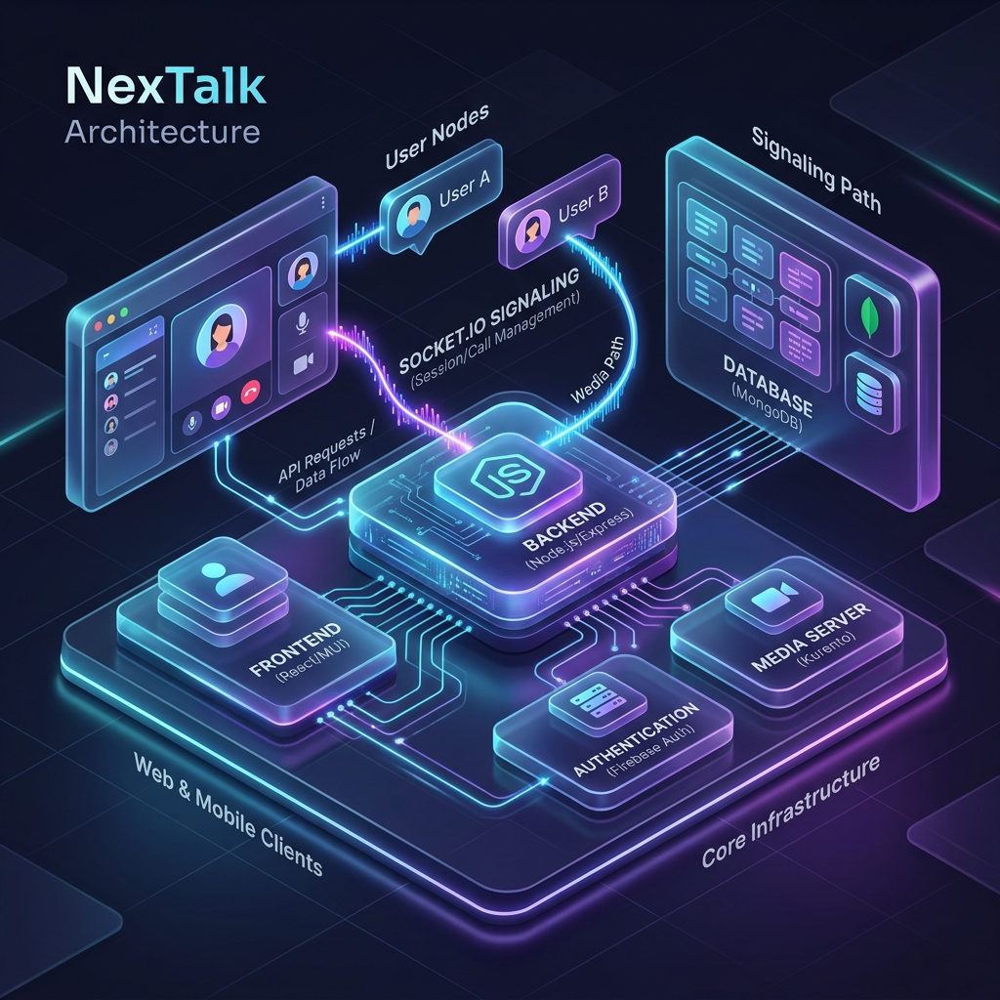
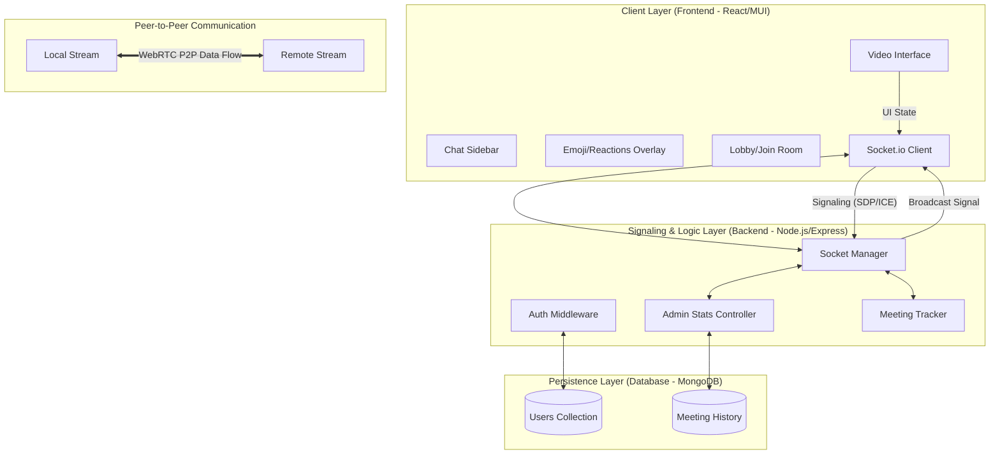
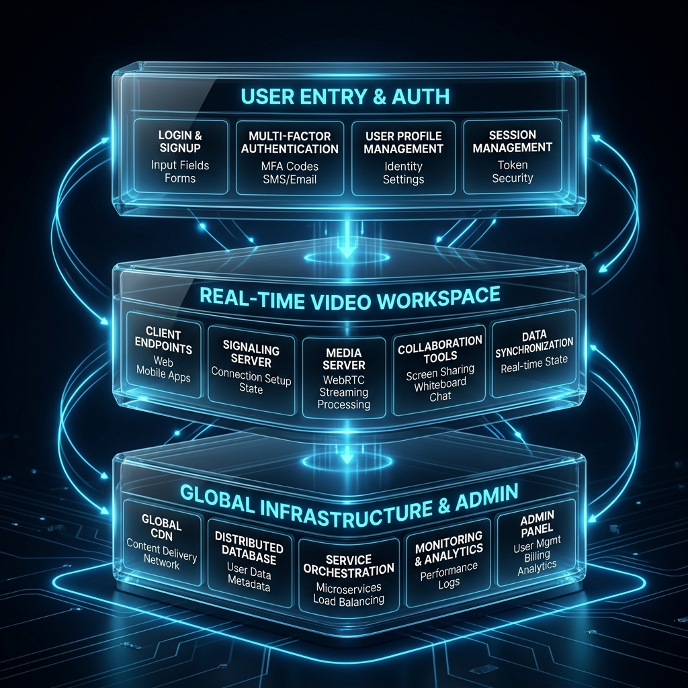
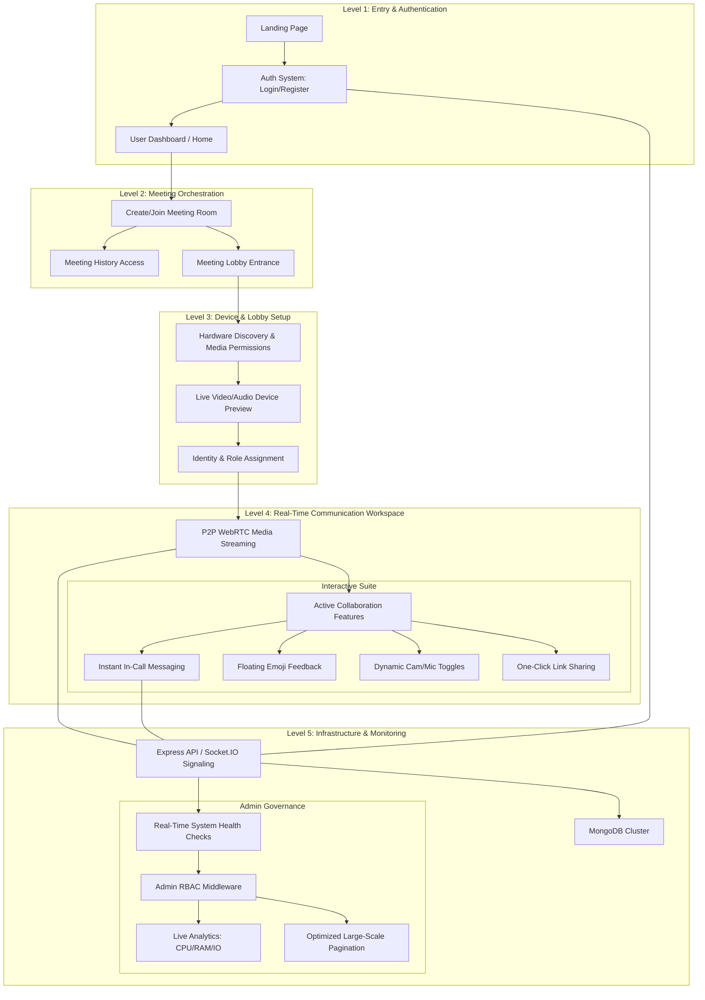

# NexTalk Architecture Overview

NexTalk follows a high-performance **3-Tier Architecture** optimized for real-time video communication.

## 🏗️ Technical Architecture Diagram

## 📦 Professional Functional Block Diagram

## 🚀 Key Architectural Pillars & Features

1.  **P2P WebRTC Connectivity**: NexTalk uses Socket.IO only for the initial handshake (signaling). Once the connection is established, video and audio data flow directly between users (Peer-to-Peer), significantly reducing server overhead.
2.  **Full-Stack Real-Time Features**:
    *   **Lobby System**: A sophisticated device-check stage before joining calls.
    *   **Collaboration Tools**: Integrated chat and reactions for active engagement.
    *   **Smart Persistence**: Meeting history and user settings stored with Mongoose models.
3.  **Enterprise-Grade Backend**:
    *   **Stateless Scaling**: Designed to handle multiple concurrent sessions.
    *   **Live Admin Dashboard**: Professional-grade monitoring of system resources and user activity.
    *   **Secure RBAC**: Role-based access control protecting sensitive admin operations.
4.  **Performance Optimization**:
    *   **Sub-100ms Latency**: Optimized signaling path for near-instant connections.
    *   **Server-Side Pagination**: Critical for performance when handling thousands of meeting records.
5.  **Security Hardening**: Standardized use of `helmet`, `bcrypt`, and secure CSP directives.
